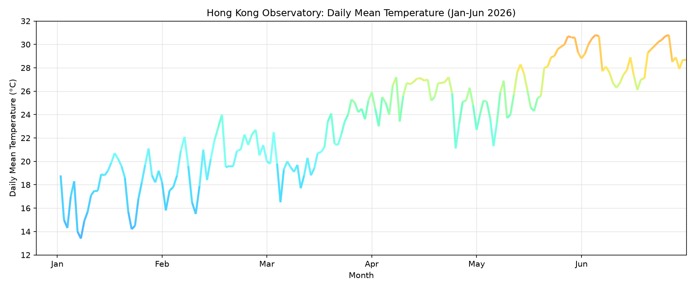

# Hong Kong Half-Year Daily Mean Temperature




## The phenomenon

Daily average air temperature in Hong Kong rises and falls over the first six months of 2026. From January to June, the baseline temperature gradually climbs from cool winter conditions to hot summer weather, while short-term weather fluctuations create sharp day-to-day temperature oscillations. I chose this dataset because temperature is a continuous natural phenomenon that works well for a gradient-coloured line: colour can directly encode the temperature value along the curve, so viewers can read both time trend and thermal intensity at a glance.

## The source
https://data.gov.hk/en-data/dataset/hk-hko-rss-daily-temperature-info-hko
Data from Hong Kong Observatory public meteorological records. The CSV file contains daily weather records starting from 2026-01-01. Each row represents one calendar day, with columns for year, month, day, daily mean temperature in degrees Celsius, and a quality flag. The full dataset originally includes dates up to August 31.


## What the picture shows
The graph plots half-year temperature changes from January to June, with the line colour smoothly shifting from cool blue at low temperatures to warm orange at high temperatures. The visualisation discards all data from July and August, limiting the time range to six months. 

## Run it

```
### Static image visualization
uv run fetch.py
uv run plot.py

### Interactive webpage visualization
uv run streamlit run app.py
```
